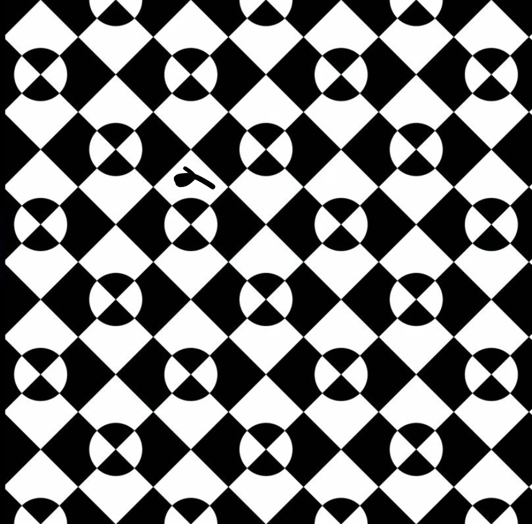
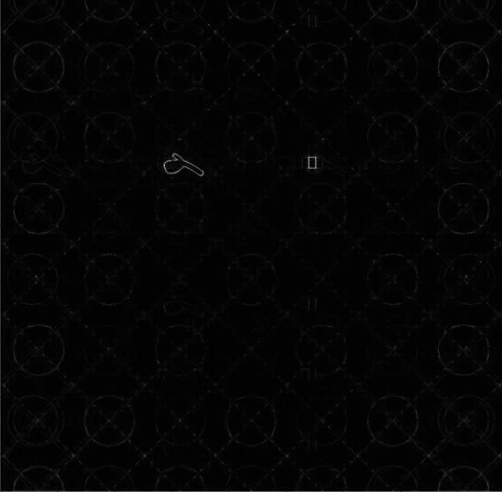
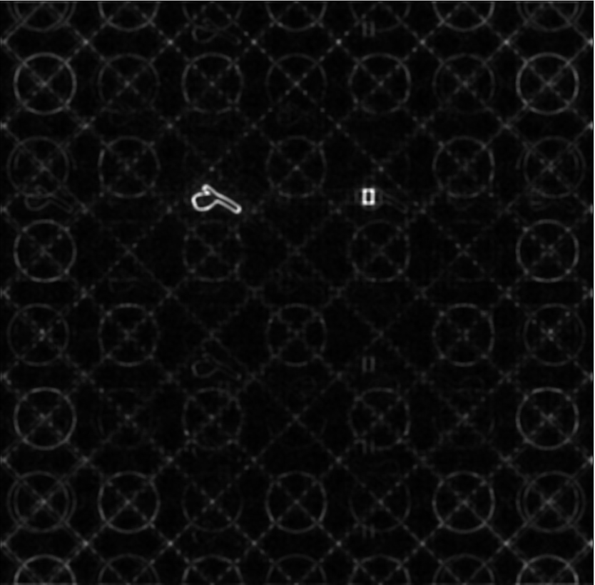
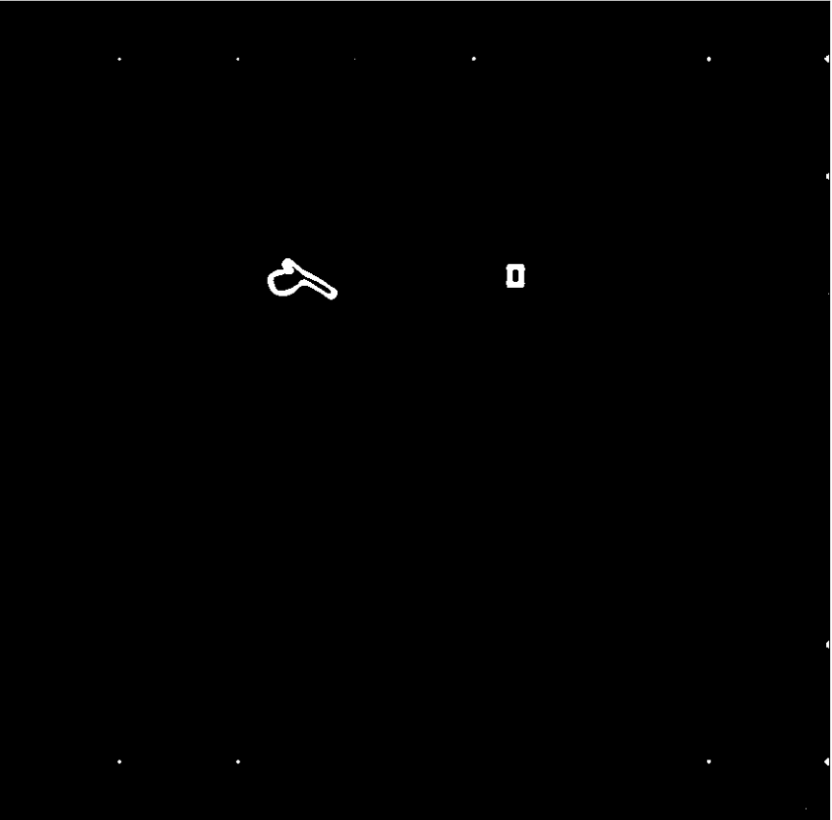
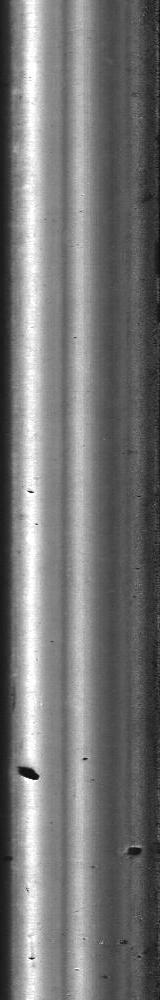
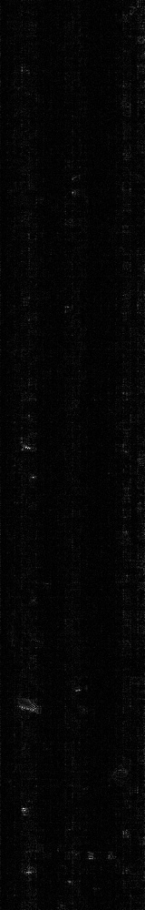
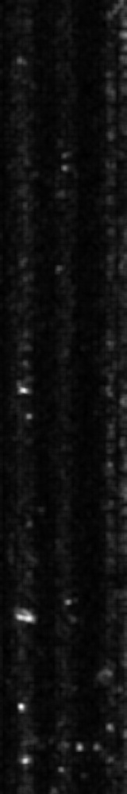
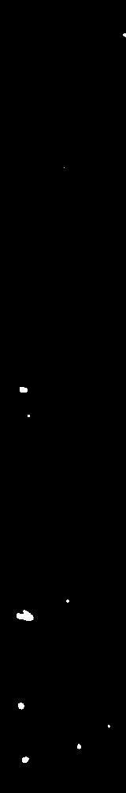
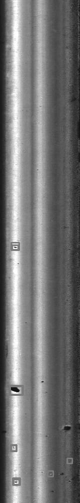

# PHOT
这个代码是phase by transform的python实现，
notebook可以直接下到本地运行，进行缺陷检测。
由于缺陷检测使用深度学习基本上只要收集足够的数据就可以通过构建模型，来获得不错的效果，这里着重介绍一种无监督的方法来实现缺陷检测，从而避免深度学习模型的数据收集和模型训练，还有对算力的需求的这些缺点。

# Requirements
numpy or opencv

# **工业质检之缺陷检测**
工业质检是生产过程中保证产品质量的重要环节。而缺陷检测和分类则是工业质检中最为关键的环节之一。随着计算机视觉和深度学习技术的不断发展，工业质检的自动化程度得到了很大的提升，特别是在缺陷检测和分类方面。这里将介绍一些常用的缺陷检测方法，包括无监督学习和深度学习的自编码器，以及缺陷的分类方法——卷积神经网络。

# **缺陷检测之PHOT**
无监督学习的缺陷检测方法是基于PHOT原理通过傅立叶变换实现的。PHOT是一种在计算机视觉中广泛使用的无监督学习算法，它基于傅立叶变换对图像进行分析和处理。PHOT算法的基本思想是将输入的图像进行傅立叶变换，然后对变换后的频域图像进行分析和处理，以实现对图像中缺陷的检测和分类。这种方法的优点是不需要进行监督学习，而且可以快速检测出图像中的缺陷，但是由于缺乏训练样本，它的准确性可能会受到一定的影响，但是优势非常明显。

# **自编码器**
另一种常用的缺陷检测方法是基于深度学习的自编码器。自编码器是一种无监督学习的神经网络模型，它可以从数据中学习出一种高维表示，并用这种高维表示来重构输入数据。在缺陷检测中，自编码器可以用来检测产品表面的缺陷，并进行缺陷位置的定位。在训练时，自编码器可以通过学习图像数据中的特征，来自动检测和定位缺陷。与PHOT算法相比，自编码器的缺点是需要大量的训练数据和计算资源，但是它的准确性和鲁棒性都比较高。

除了缺陷检测，缺陷分类也是工业质检中的重要环节。卷积神经网络（CNN）是一种被广泛应用于图像分类的深度学习模型，它可以通过学习输入图像中的特征来进行分类。在缺陷分类中，CNN可以用来对缺陷进行分类，例如区分不同类型的裂纹、气泡和瑕疵等。通过对训练数据进行学习，CNN可以自动提取出图像中的特征，并用这些特征进行分类。

# **一些POHT实现的缺陷检测效果图**
1.下面第一张图片为带有缺陷的原图，原图是背景比较有规律的图片，缺陷比较突兀，所以非常适合PHOT进行快速的无监督缺陷定位。

2.第二张图片是对原图频谱图进行幅度归一化之后，再对归一化之后的频谱图进行逆傅立叶变换之后的重构图片，可以看到此时的缺陷的位置已经比较明显的突出了，而正常的背景被过滤掉了。

3.第三张图片对重构图进行高斯模糊，降噪，然后将图片分布归一化道0，1正态分布（为何要这样归一化，是为了将所有的检测图片统一到一个量纲，从而为最后一步的二值化统一阈值）

4.第四张图是利用马氏距离，将阈值设置为7，从而得到了二值图，最终利用二值图找缺陷的位置就可以实现缺陷定位了。

    
    
    
    

1.下面第一张图片为带有缺陷的原图，原图是背景比较复杂的图片，缺陷虽然比较明显，但是也有比较多的噪声存在，但PHOT也能成功的进行快速的无监督缺陷定位。

2.第二张图片是对原图频谱图进行幅度归一化之后，再对归一化之后的频谱图进行逆傅立叶变换之后的重构图片，可以看到此时的缺陷的位置已经比较明显的突出了，而正常的背景被过滤掉了。

3.第三张图片对重构图进行高斯模糊，降噪，然后将图片分布归一化道0，1正态分布（为何要这样归一化，是为了将所有的检测图片统一到一个量纲，从而为最后一步的二值化统一阈值）

4.第四张图是利用马氏距离，将阈值设置为7，从而得到了二值图，最终利用二值图找缺陷的位置就可以实现缺陷定位了。

5.第五张图就是缺陷检测的位置。（可以看到缺陷检测的效果还是不错的）

    
    
    
    
    

# **如何使用此代码**
直接打开上面的jupyter文件phot_note.ipynb，将里面的img_path改成你想测试的图片路径，从上往下执行代码就可以得到缺陷检测的结果图。
